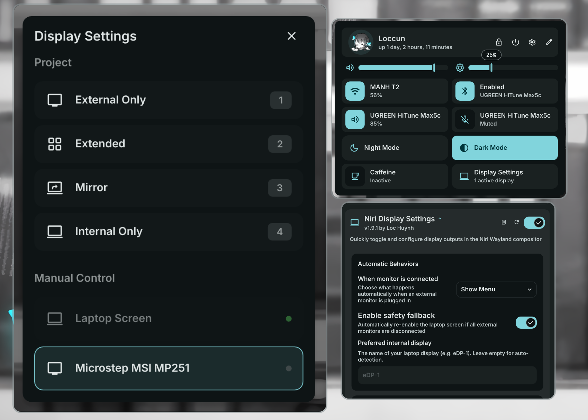

# Niri Display Settings

Quickly manage, toggle, and configure display outputs in the Niri Wayland compositor.



## Install

**Required:** This plugin requires [dms-common](https://github.com/hthienloc/dms-common) to be installed.

```bash
# 1. Install shared components
git clone https://github.com/hthienloc/dms-common ~/.config/DankMaterialShell/plugins/dms-common

# 2. Install this plugin
dms plugins install niriDS
```

Or manually:
```bash
git clone https://github.com/hthienloc/dms-niri-display-settings ~/.config/DankMaterialShell/plugins/niriDS
```

## Features

- Display profiles: Internal Only, External Only, Extend, Mirror
- Manual toggle for each display
- Auto-show or auto-apply profile when monitor plugged in
- Auto-enable laptop screen when external monitors disconnected

## IPC Commands

Use `dms ipc call niriDS <command>` to control the display selector.

| Command | Description |
|---------|-------------|
| `open` | Open the display settings modal |
| `close` | Close the display settings modal |
| `toggle` | Toggle the display settings modal |
| `apply <profile>` | Apply a profile: `internal_only`, `external_only`, `extend`, `mirror` |

### Keybinding example (Niri)

```kdl
binds {
    Mod+P { spawn "dms" "ipc" "call" "niriDS" "toggle"; }
}
```

## Requirements

- DankMaterialShell >= 1.5
- Niri Wayland compositor
- `wl-mirror`

## License

MIT